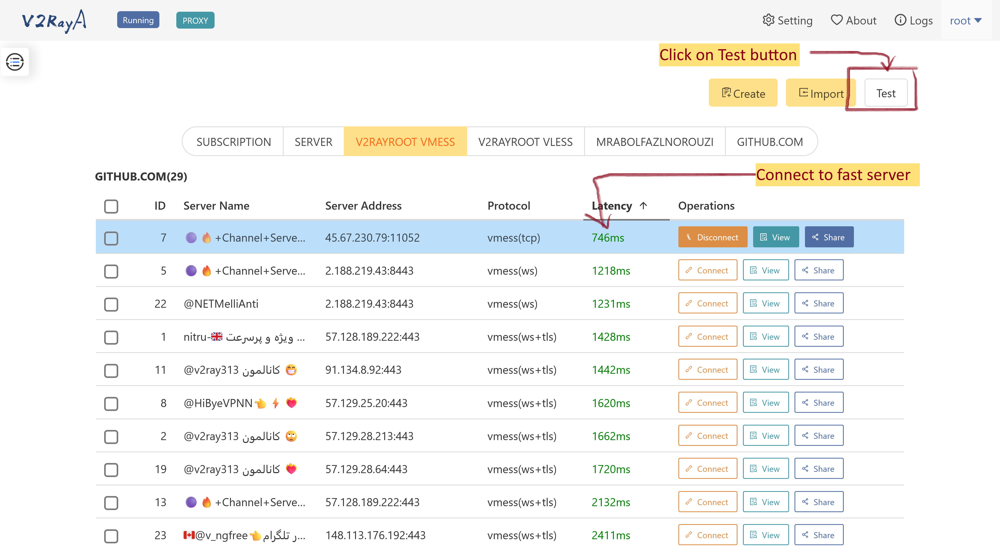

# V2RayA test servers

Add "Test" button to V2RayA list page to test servers and connected to fast server. This version create for OpenWRT package.

## Install
You can install with "[Greasemonkey](https://addons.mozilla.org/en-US/firefox/addon/greasemonkey/)" 

OpenUserJs: https://openuserjs.org/scripts/parsa-kafi/V2RayA_Test_Servers